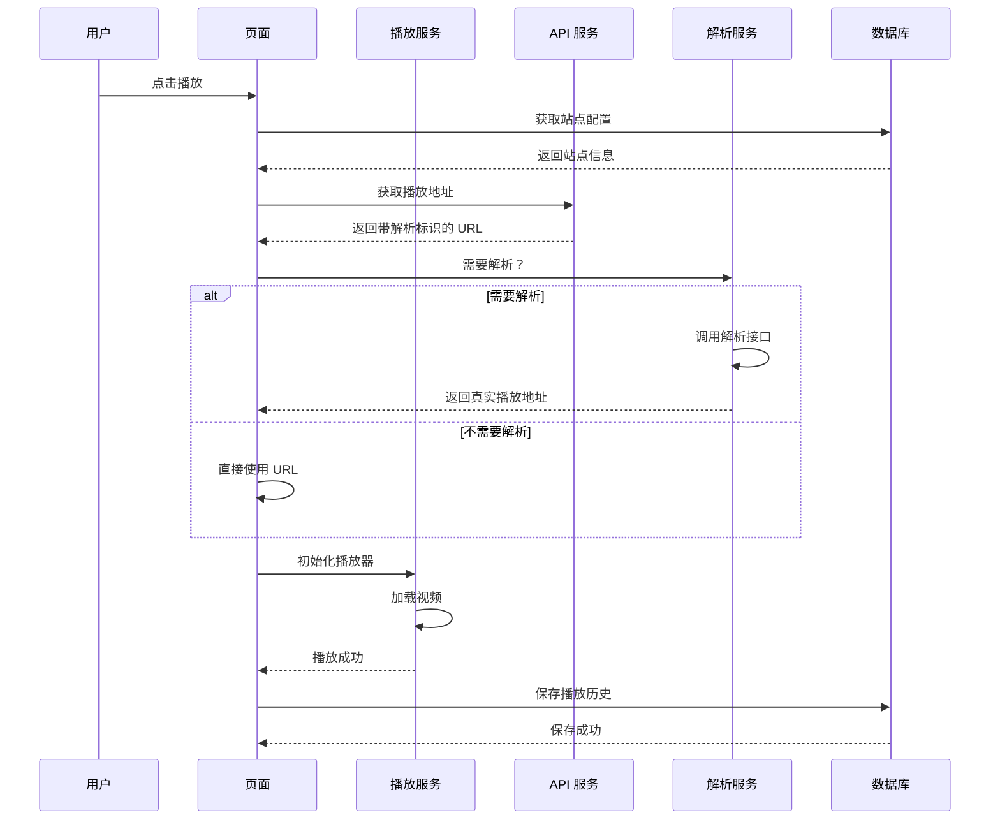
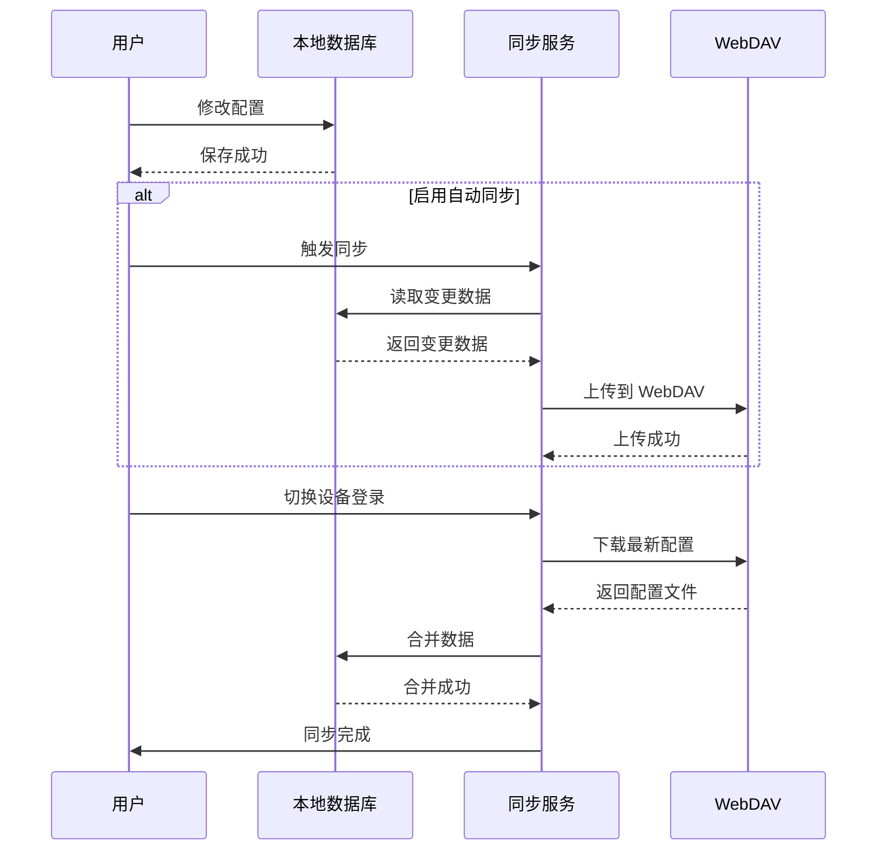
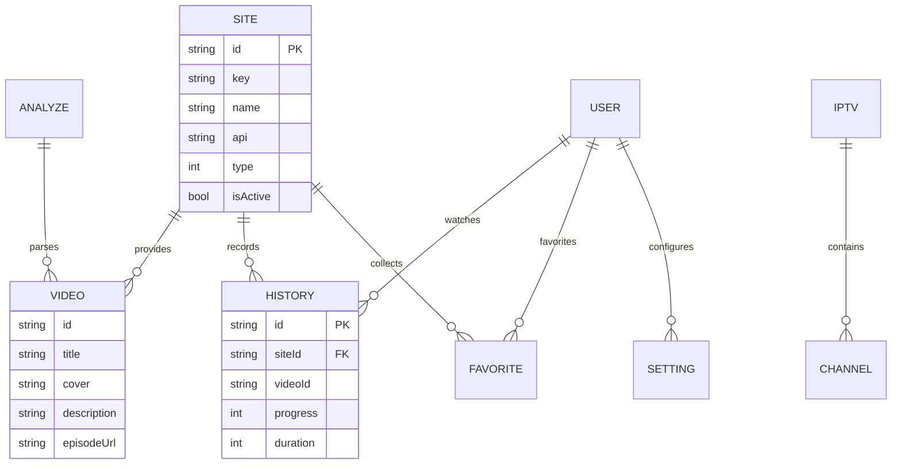
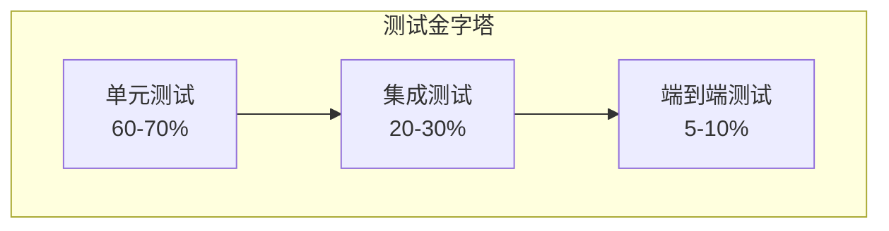

# zyfun Flutter 移动端技术设计文档

**Feature Name**: zyfun-flutter-mobile  
**Updated**: 2026-06-03

## 1. 描述

将 Electron + Vue3 桌面应用重构为 Flutter 移动端应用，实现 Android 和 iOS 双平台支持，保持与原应用 1:1 的功能还原。

### 1.1 核心目标

- **功能完整**: 1:1 还原原应用所有前端功能
- **架构清晰**: 采用分层架构，便于维护和扩展
- **性能优化**: 移动端性能优化，流畅体验
- **代码复用**: 最大化复用原有业务逻辑和 API 设计

### 1.2 技术选型

| 类别 | 技术 | 说明 |
|------|------|------|
| 开发框架 | Flutter 3.16+ | 跨平台移动开发 |
| 状态管理 | Riverpod 2.4+ | 响应式状态管理 |
| 本地数据库 | sqflite / isar | 替代 libsql |
| 网络请求 | dio 5.4+ | HTTP 客户端 |
| 视频播放 | fijkplayer / media_kit | 跨平台播放器 |
| UI 组件 | shadcn_ui (Flutter) | 现代化简洁组件库 |
| 路由管理 | go_router 12.0+ | 声明式路由 |
| 依赖注入 | riverpod_generator | 代码生成 DI |
| 数据序列化 | json_serializable | JSON 序列化 |
| 本地存储 | shared_preferences | 轻量级存储 |
| 云同步 | webdav_client | WebDAV 同步 |
| 弹幕 | 自研 | 基于 canvas 渲染 |

### 1.3 shadcn_ui 使用规范

**核心组件**:
- `ShadButton` - 按钮 (支持 primary, secondary, outline, ghost 等变体)
- `ShadInput` - 输入框 (支持文本、密码、搜索等类型)
- `ShadCard` - 卡片容器 (用于视频卡片、列表项)
- `ShadDialog` - 对话框 (确认、表单、提示)
- `ShadLoading` - 加载指示器
- `ShadTable` - 表格 (用于数据列表)
- `ShadDropdown` - 下拉菜单
- `ShadTabs` - 标签页切换
- `ShadSwitch` - 开关 (用于设置项)
- `ShadSlider` - 滑块 (用于进度条、音量调节)
- `ShadSelect` - 选择框
- `ShadPopover` - 弹出框
- `ShadToast` - 提示消息
- `ShadForm` - 表单容器

**主题配置**:
```dart
import 'package:shadcn_ui/shadcn_ui.dart';

@override
Widget build(BuildContext context) {
  return ShadApp(
    debugShowCheckedModeBanner: false,
    theme: ShadThemeData(
      brightness: Brightness.light,
      colorScheme: const ShadZincColorScheme.light(),
    ),
    darkTheme: ShadThemeData(
      brightness: Brightness.dark,
      colorScheme: const ShadSlateColorScheme.dark(
        background: Colors.blue, // 自定义背景色
      ),
      primaryButtonTheme: const ShadButtonTheme(
        backgroundColor: Colors.cyan, // 自定义按钮颜色
      ),
    ),
    themeMode: ThemeMode.system, // 跟随系统
    home: const HomePage(),
  );
}
```

**图标集成** (使用 Lucide Icons):
```dart
import 'package:lucide_icons_flutter/lucide_icons_flutter.dart';

// 使用示例
ShadButton(
  onPressed: () {},
  leading: const Icon(LucideIcons.mail),
  child: const Text('Login with Email'),
)
```

**表单验证示例**:
```dart
ShadForm(
  child: Column(
    children: [
      ShadInputFormField(
        label: const Text('Name'),
        initialValue: 'Ale',
        validator: (value) {
          if (value == null || value.isEmpty) {
            return 'Name is required';
          }
          return null;
        },
      ),
      ShadSelectFormField<String>(
        label: const Text('Framework'),
        options: [
          ShadOption(value: 'next', child: const Text('Next.js')),
          ShadOption(value: 'react', child: const Text('React')),
        ],
        validator: (value) {
          if (value == null) {
            return 'Please select a framework';
          }
          return null;
        },
      ),
      ShadButton(
        child: const Text('Save'),
        onPressed: () {
          // 表单验证通过后才执行
        },
      ),
    ],
  ),
)
```

**使用示例 - 卡片组件**:
```dart
ShadCard(
  width: 350,
  title: Text('Create project', style: theme.textTheme.h4),
  description: const Text('Deploy your new project in one-click.'),
  footer: Row(
    mainAxisAlignment: MainAxisAlignment.spaceBetween,
    children: [
      ShadButton.outline(
        child: const Text('Cancel'),
        onPressed: () {},
      ),
      ShadButton(
        child: const Text('Deploy'),
        onPressed: () {},
      ),
    ],
  ),
  child: Padding(
    padding: const EdgeInsets.symmetric(vertical: 16),
    child: Column(
      children: [
        const ShadInput(placeholder: Text('Name of your project')),
        const SizedBox(height: 16),
        ShadSelect<String>(
          placeholder: const Text('Select'),
          options: [
            ShadOption(value: 'next', child: const Text('Next.js')),
            ShadOption(value: 'react', child: const Text('React')),
          ],
          selectedOptionBuilder: (context, value) {
            return Text(frameworks[value]!);
          },
          onChanged: (value) {},
        ),
      ],
    ),
  ),
)
```

**按钮变体示例**:
```dart
// Primary Button
ShadButton(
  child: const Text('Primary'),
  onPressed: () {},
)

// Secondary Button
ShadButton.secondary(
  child: const Text('Secondary'),
  onPressed: () {},
)

// Destructive Button
ShadButton.destructive(
  child: const Text('Destructive'),
  onPressed: () {},
)

// Outline Button
ShadButton.outline(
  child: const Text('Outline'),
  onPressed: () {},
)

// Ghost Button
ShadButton.ghost(
  child: const Text('Ghost'),
  onPressed: () {},
)

// Link Button
ShadButton.link(
  child: const Text('Link'),
  onPressed: () {},
)

// Loading Button
ShadButton(
  onPressed: () {},
  leading: SizedBox.square(
    dimension: 16,
    child: CircularProgressIndicator(
      strokeWidth: 2,
      color: ShadTheme.of(context).colorScheme.primaryForeground,
    ),
  ),
  child: const Text('Please wait'),
)

// Gradient Button
ShadButton(
  onPressed: () {},
  gradient: const LinearGradient(colors: [Colors.cyan, Colors.indigo]),
  shadows: [
    BoxShadow(
      color: Colors.blue.withOpacity(.4),
      spreadRadius: 4,
      blurRadius: 10,
      offset: const Offset(0, 2),
    ),
  ],
  child: const Text('Gradient with Shadow'),
)
```

**标签页示例**:
```dart
ShadTabs<String>(
  value: 'account',
  tabBarConstraints: const BoxConstraints(maxWidth: 400),
  contentConstraints: const BoxConstraints(maxWidth: 400),
  tabs: [
    ShadTab(
      value: 'account',
      content: ShadCard(
        title: const Text('Account'),
        description: const Text('Make changes to your account here.'),
        footer: const ShadButton(child: Text('Save changes')),
        child: Column(
          children: [
            ShadInputFormField(label: const Text('Name')),
            ShadInputFormField(label: const Text('Username')),
          ],
        ),
      ),
      child: const Text('Account'),
    ),
    ShadTab(
      value: 'password',
      content: ShadCard(
        title: const Text('Password'),
        footer: const ShadButton(child: Text('Save password')),
        child: Column(
          children: [
            ShadInputFormField(
              label: const Text('Current password'),
              obscureText: true,
            ),
            ShadInputFormField(
              label: const Text('New password'),
              obscureText: true,
            ),
          ],
        ),
      ),
      child: const Text('Password'),
    ),
  ],
)
```

### 1.4 移动端适配
- shadcn_ui 组件默认支持触摸操作
- 需要使用 `ResponsiveBuilder` 适配不同屏幕尺寸
- 暗色模式需要单独配置
- 表单组件自动处理键盘和焦点管理

## 2. 架构设计

### 2.1 整体架构

```mermaid
graph TB
    subgraph Presentation Layer
        UI[UI Widgets]
        Pages[Pages]
        Components[Components]
        Themes[Themes]
    end
    
    subgraph State Management Layer
        Providers[Riverpod Providers]
        Notifiers[State Notifiers]
        Controllers[Controllers]
    end
    
    subgraph Business Logic Layer
        Services[Services]
        Repositories[Repositories]
        UseCases[Use Cases]
    end
    
    subgraph Data Layer
        Models[Models]
        DataSources[Data Sources]
        ApiClient[API Client]
        LocalDB[Local Database]
        Storage[Local Storage]
    end
    
    subgraph Platform Layer
        Android[Android Platform]
        iOS[iOS Platform]
        Plugins[Platform Plugins]
    end
    
    UI --> Providers
    Providers --> Notifiers
    Notifiers --> UseCases
    UseCases --> Repositories
    Repositories --> DataSources
    Repositories --> LocalDB
    DataSources --> ApiClient
    ApiClient --> Platform Layer
    LocalDB --> Platform Layer
    Plugins --> Platform Layer

```

### 2.2 分层说明

#### Presentation Layer (展示层)
- **UI Widgets**: 基于 shadcn_ui 的基础组件 (按钮、输入框、卡片、对话框等)
- **Pages**: 页面级组件 (影视、直播、播放、设置等)
- **Components**: 可复用业务组件 (播放器、列表、导航、弹幕等)
- **Themes**: 主题配置 (亮色/暗色/多语言，基于 shadcn_ui 主题系统)

#### State Management Layer (状态管理层)
- **Providers**: Riverpod Provider 定义
- **Notifiers**: StateNotifier 实现业务状态
- **Controllers**: 页面控制器

#### Business Logic Layer (业务逻辑层)
- **Services**: 业务服务 (解析、嗅探、播放等)
- **Repositories**: 数据仓库 (站点、直播、历史等)
- **Use Cases**: 用例封装 (搜索、收藏、导入导出等)

#### Data Layer (数据层)
- **Models**: 数据模型定义
- **DataSources**: 数据源接口 (远程/本地)
- **ApiClient**: HTTP 请求封装
- **LocalDB**: SQLite 数据库操作
- **Storage**: 键值对存储

#### Platform Layer (平台层)
- **Android/iOS**: 原生平台实现
- **Plugins**: Flutter 插件 (播放器、存储、权限等)

### 2.3 项目初始化步骤

**步骤 1: 创建 Flutter 项目**
```bash
flutter create --org com.zyfun zyfun_mobile
cd zyfun_mobile
```

**步骤 2: 安装核心依赖**
```bash
# 状态管理
flutter pub add flutter_riverpod riverpod_annotation
flutter pub add --dev riverpod_generator build_runner

# 路由
flutter pub add go_router

# 网络请求
flutter pub add dio

# UI 组件库
flutter pub add shadcn_ui lucide_icons_flutter

# 数据序列化
flutter pub add json_annotation freezed_annotation
flutter pub add --dev json_serializable freezed build_runner

# 本地数据库
flutter pub add sqflite path

# 本地存储
flutter pub add shared_preferences flutter_secure_storage

# 播放器
flutter pub add fijkplayer

# 云同步
flutter pub add webdav_client

# JSON 处理
flutter pub add http_parser

# 权限管理
flutter pub add permission_handler

# 通知
flutter pub add audio_service

# 日志
flutter pub add logger
```

**步骤 3: 配置 pubspec.yaml**
```yaml
name: zyfun_mobile
description: zyfun Flutter Mobile App

publish_to: 'none'

version: 1.0.0+1

environment:
  sdk: '>=3.2.0 <4.0.0'
  flutter: '>=3.16.0'

dependencies:
  flutter:
    sdk: flutter
  flutter_localizations:
    sdk: flutter

  # 核心依赖
  shadcn_ui: ^0.54.0
  lucide_icons_flutter: ^3.0.0
  flutter_riverpod: ^2.4.0
  riverpod_annotation: ^2.3.0
  go_router: ^12.0.0
  dio: ^5.4.0

  # 数据存储
  sqflite: ^2.3.0
  path: ^1.8.3
  shared_preferences: ^2.2.0
  flutter_secure_storage: ^9.0.0
  json_annotation: ^4.8.0
  freezed_annotation: ^2.4.0

  # 媒体播放
  fijkplayer: ^0.10.0

  # 工具库
  logger: ^2.0.0
  permission_handler: ^11.0.0
  audio_service: ^0.18.0
  webdav_client: ^1.2.0

dev_dependencies:
  flutter_test:
    sdk: flutter
  flutter_lints: ^3.0.0
  build_runner: ^2.4.0
  riverpod_generator: ^2.3.0
  json_serializable: ^6.7.0
  freezed: ^2.4.0

flutter:
  uses-material-design: true
  
  # 配置字体
  fonts:
    - family: Inter
      fonts:
        - asset: assets/fonts/Inter-Regular.ttf
        - asset: assets/fonts/Inter-Bold.ttf
          weight: 700
```

**步骤 4: 运行代码生成**
```bash
flutter pub run build_runner build --delete-conflicting-outputs
```

**步骤 5: 验证安装**
```bash
flutter analyze
flutter test
```

```
lib/
├── main.dart                    # 应用入口
├── app/
│   ├── app.dart                 # 应用配置
│   ├── routes.dart              # 路由配置
│   └── theme.dart               # 主题配置
├── core/
│   ├── constants/               # 常量定义
│   ├── errors/                  # 错误定义
│   ├── utils/                   # 工具函数
│   └── extensions/              # 扩展方法
├── data/
│   ├── models/                  # 数据模型
│   │   ├── site.dart           # 站点模型
│   │   ├── iptv.dart           # 直播模型
│   │   ├── analyze.dart        # 解析模型
│   │   ├── drive.dart          # 网盘模型
│   │   ├── setting.dart        # 设置模型
│   │   ├── history.dart        # 历史模型
│   │   └── video.dart          # 视频模型
│   ├── repositories/            # 数据仓库
│   │   ├── site_repository.dart
│   │   ├── iptv_repository.dart
│   │   ├── analyze_repository.dart
│   │   ├── history_repository.dart
│   │   └── setting_repository.dart
│   ├── datasources/             # 数据源
│   │   ├── remote/             # 远程数据源
│   │   │   ├── api_client.dart
│   │   │   ├── site_api.dart
│   │   │   ├── iptv_api.dart
│   │   │   └── video_api.dart
│   │   └── local/              # 本地数据源
│   │       ├── database.dart
│   │       ├── storage.dart
│   │       └── prefs.dart
│   └── dto/                     # 数据传输对象
├── domain/
│   ├── entities/                # 领域实体
│   ├── repositories/            # 仓库接口
│   └── usecases/                # 用例
│       ├── search_usecase.dart
│       ├── play_usecase.dart
│       ├── favorite_usecase.dart
│       └── sync_usecase.dart
├── presentation/
│   ├── providers/               # Riverpod Providers
│   │   ├── site_provider.dart
│   │   ├── iptv_provider.dart
│   │   ├── player_provider.dart
│   │   └── setting_provider.dart
│   ├── pages/                   # 页面
│   │   ├── home/               # 首页
│   │   ├── film/               # 影视
│   │   ├── live/               # 直播
│   │   ├── player/             # 播放
│   │   ├── history/            # 历史
│   │   ├── favorite/           # 收藏
│   │   ├── parse/              # 解析
│   │   ├── setting/            # 设置
│   │   └── search/             # 搜索
│   ├── components/              # 业务组件
│   │   ├── player/             # 播放器组件
│   │   ├── video_card/         # 视频卡片
│   │   ├── nav_bar/            # 导航栏
│   │   └── danmaku/            # 弹幕组件
│   └── shadcn/                  # shadcn_ui 组件
│       ├── button/
│       ├── input/
│       ├── card/
│       ├── dialog/
│       ├── loading/
│       ├── table/
│       └── dropdown/
├── services/                    # 业务服务
│   ├── player_service.dart     # 播放服务
│   ├── sniffer_service.dart    # 嗅探服务
│   ├── parse_service.dart      # 解析服务
│   ├── ai_service.dart         # AI 服务
│   ├── sync_service.dart       # 同步服务
│   └── update_service.dart     # 更新服务
├── config/                      # 配置
│   ├── api_config.dart         # API 配置
│   ├── player_config.dart      # 播放器配置
│   └── app_config.dart         # 应用配置
└── plugins/                     # 平台插件
    ├── permission/             # 权限管理
    ├── notification/           # 通知管理
    └── background/             # 后台任务

```

## 3. 组件与接口

### 3.1 核心组件

#### 3.1.1 播放器组件

```dart
// 参考原项目 @oplayer 系列播放器
class ZyPlayer extends StatefulWidget {
  final String url;
  final String title;
  final String cover;
  final PlayerConfig config;
  final Function(String url)? onUrlReady;
  final Function(double progress)? onProgressUpdate;
  final Function()? onCompleted;
  
  @override
  State<ZyPlayer> createState() => _ZyPlayerState();
}

// 支持多种播放器内核
enum PlayerType {
  fijkplayer,    // 基于 ijkplayer
  media_kit,     // 基于 libmpv
  chewie,        // 基于 video_player
  custom,        // 自定义播放器
}
```

#### 3.1.2 视频列表组件

```dart
// 支持无限加载的视频列表
class VideoGrid extends StatelessWidget {
  final AsyncValue<List<Video>> videos;
  final Future<void> Function()? onLoadMore;
  final Function(Video video)? onTap;
  
  @override
  Widget build(BuildContext context) {
    return videos.when(
      data: (data) => GridView.builder(
        itemCount: data.length + (hasMore ? 1 : 0),
        itemBuilder: (context, index) {
          if (index == data.length) {
            return LoadingIndicator();
          }
          return VideoCard(video: data[index]);
        },
      ),
      loading: () => ShimmerLoading(),
      error: (error, stack) => ErrorWidget(error),
    );
  }
}
```

#### 3.1.3 弹幕组件

```dart
// 基于 CustomPainter 的弹幕渲染
class DanmakuCanvas extends CustomPainter {
  final List<Danmaku> danmakus;
  final double canvasWidth;
  final double canvasHeight;
  
  @override
  void paint(Canvas canvas, Size size) {
    // 弹幕绘制逻辑
    for (var danmaku in danmakus) {
      _drawDanmaku(canvas, danmaku);
    }
  }
}
```

### 3.2 数据模型

#### 3.2.1 站点模型

```dart
@JsonSerializable()
class Site {
  final String id;
  final String key;
  final String name;
  final String api;
  final String playUrl;
  final int search; // 是否支持搜索
  final String group;
  final int type; // 适配器类型
  final String ext;
  final String categories;
  final bool isActive;
  final DateTime createdAt;
  final DateTime updatedAt;
  
  factory Site.fromJson(Map<String, dynamic> json) => _$SiteFromJson(json);
  Map<String, dynamic> toJson() => _$SiteToJson(this);
}
```

#### 3.2.2 直播模型

```dart
@JsonSerializable()
class Iptv {
  final String id;
  final String key;
  final String name;
  final String api;
  final int type; // 1=远程，2=本地，3=文本
  final String epg;
  final String logo;
  final Map<String, dynamic> headers;
  final bool isActive;
  final DateTime createdAt;
  final DateTime updatedAt;
  
  factory Iptv.fromJson(Map<String, dynamic> json) => _$IptvFromJson(json);
  Map<String, dynamic> toJson() => _$IptvToJson(this);
}
```

#### 3.2.3 解析模型

```dart
@JsonSerializable()
class Analyze {
  final String id;
  final String key;
  final String name;
  final String api;
  final int type; // 1=web, 2=json
  final List<String> flag;
  final Map<String, dynamic> headers;
  final String script;
  final bool isActive;
  final DateTime createdAt;
  final DateTime updatedAt;
  
  factory Analyze.fromJson(Map<String, dynamic> json) => _$AnalyzeFromJson(json);
  Map<String, dynamic> toJson() => _$AnalyzeToJson(this);
}
```

#### 3.2.4 设置模型

```dart
@JsonSerializable()
class Setting {
  final String version;
  final String theme; // system, light, dark
  final String lang; // zh_CN, zh_TW, en_US, ...
  final double zoom;
  final ProxyConfig proxy;
  final String hot; // 热搜数据源
  final String association; // 搜索联想数据源
  final SiteConfig site;
  final LiveConfig live;
  final String defaultSite;
  final String defaultIptv;
  final String defaultAnalyze;
  final DanmakuConfig barrage;
  final PlayerConfig player;
  final SnifferConfig sniffer;
  final bool autoStart;
  final bool hardwareAcceleration;
  final String ua;
  final String dns;
  final CloudConfig cloud;
  final AiConfig aigc;
  final int timeout;
  final WindowConfig windowPosition;
  final bool debug;
  
  factory Setting.fromJson(Map<String, dynamic> json) => _$SettingFromJson(json);
  Map<String, dynamic> toJson() => _$SettingToJson(this);
}
```

### 3.3 接口定义

#### 3.3.1 数据仓库接口

```dart
abstract class SiteRepository {
  Future<List<Site>> getAllSites();
  Future<Site?> getSiteById(String id);
  Future<void> addSite(Site site);
  Future<void> updateSite(Site site);
  Future<void> deleteSite(String id);
  Future<void> setDefaultSite(String id);
  Future<String?> getDefaultSite();
  Future<List<Video>> searchVideos(String siteId, String keyword);
  Future<List<Category>> getCategories(String siteId);
  Future<List<Video>> getVideosByCategory(String siteId, String categoryId, int page);
  Future<VideoDetail> getVideoDetail(String siteId, String videoId);
  Future<String> getPlayUrl(String siteId, String episodeUrl);
}
```

#### 3.3.2 播放服务接口

```dart
abstract class PlayerService {
  Future<void> initialize();
  Future<void> play(String url, {String? title, String? cover});
  Future<void> pause();
  Future<void> resume();
  Future<void> stop();
  Future<void> seekTo(Duration position);
  Future<Duration> getDuration();
  Future<Duration> getPosition();
  Future<double> getSpeed();
  Future<void> setSpeed(double speed);
  Stream<PlayerState> get stateStream;
  Stream<Duration> get progressStream;
}
```

#### 3.3.3 嗅探服务接口

```dart
abstract class SnifferService {
  Future<String?> sniffUrl(String pageUrl, {SnifferConfig? config});
  Future<List<String>> sniffUrls(List<String> pageUrls);
  Future<bool> isVideoUrl(String url);
  Future<void> setRule(String rule);
  Future<String> getHtml(String url);
}
```

## 4. 核心业务流程

### 4.1 视频播放流程



### 4.2 数据同步流程



## 5. 数据模型

### 5.1 数据库设计

```sql
-- 站点表
CREATE TABLE sites (
    id TEXT PRIMARY KEY,
    key TEXT NOT NULL,
    name TEXT NOT NULL,
    api TEXT NOT NULL,
    playUrl TEXT,
    search INTEGER DEFAULT 0,
    group TEXT,
    type INTEGER DEFAULT 1,
    ext TEXT,
    categories TEXT,
    isActive INTEGER DEFAULT 1,
    createdAt INTEGER NOT NULL,
    updatedAt INTEGER NOT NULL
);

-- 直播源表
CREATE TABLE iptvs (
    id TEXT PRIMARY KEY,
    key TEXT NOT NULL,
    name TEXT NOT NULL,
    api TEXT NOT NULL,
    type INTEGER DEFAULT 1,
    epg TEXT,
    logo TEXT,
    headers TEXT,
    isActive INTEGER DEFAULT 1,
    createdAt INTEGER NOT NULL,
    updatedAt INTEGER NOT NULL
);

-- 解析接口表
CREATE TABLE analyzes (
    id TEXT PRIMARY KEY,
    key TEXT NOT NULL,
    name TEXT NOT NULL,
    api TEXT NOT NULL,
    type INTEGER DEFAULT 1,
    flag TEXT,
    headers TEXT,
    script TEXT,
    isActive INTEGER DEFAULT 1,
    createdAt INTEGER NOT NULL,
    updatedAt INTEGER NOT NULL
);

-- 播放历史表
CREATE TABLE histories (
    id TEXT PRIMARY KEY,
    siteId TEXT NOT NULL,
    videoId TEXT NOT NULL,
    title TEXT NOT NULL,
    cover TEXT,
    description TEXT,
    episodeUrl TEXT,
    episodeName TEXT,
    progress INTEGER DEFAULT 0,
    duration INTEGER DEFAULT 0,
    createdAt INTEGER NOT NULL,
    updatedAt INTEGER NOT NULL
);

-- 收藏表
CREATE TABLE favorites (
    id TEXT PRIMARY KEY,
    siteId TEXT NOT NULL,
    videoId TEXT NOT NULL,
    title TEXT NOT NULL,
    cover TEXT,
    createdAt INTEGER NOT NULL
);

-- 设置表
CREATE TABLE settings (
    key TEXT PRIMARY KEY,
    value TEXT NOT NULL,
    updatedAt INTEGER NOT NULL
);

-- 创建索引
CREATE INDEX idx_sites_active ON sites(isActive);
CREATE INDEX idx_histories_updated ON histories(updatedAt DESC);
CREATE INDEX idx_favorites_created ON favorites(createdAt DESC);
```

### 5.2 实体关系



## 6. 正确性属性

### 6.1 数据一致性

1. **原子性**: 数据库操作必须使用事务保证原子性
2. **完整性**: 外键约束保证数据引用完整性
3. **唯一性**: id 字段必须全局唯一 (使用 UUID v4)

### 6.2 状态一致性

1. **单源真相**: 所有状态通过 Riverpod Provider 管理
2. **不可变状态**: StateNotifier 状态更新必须创建新对象
3. **乐观更新**: UI 立即响应，后台同步数据

### 6.3 错误处理

1. **网络错误**: 所有网络请求必须捕获 DioException
2. **数据库错误**: 数据库操作必须捕获 DatabaseException
3. **播放错误**: 播放器错误必须降级处理 (切换线路/提示用户)

## 7. 错误处理

### 7.1 错误类型定义

```dart
enum AppErrorType {
  network,           // 网络错误
  database,          // 数据库错误
  parse,             // 解析错误
  player,            // 播放错误
  permission,        // 权限错误
  unknown,           // 未知错误
}

class AppException implements Exception {
  final AppErrorType type;
  final String message;
  final dynamic originalError;
  final String? stackTrace;
  
  AppException({
    required this.type,
    required this.message,
    this.originalError,
    this.stackTrace,
  });
}
```

### 7.2 错误处理策略

```dart
// 全局错误处理
FlutterError.onError = (details) {
  // 记录错误日志
  logger.e('Flutter Error', error: details.exception, stackTrace: details.stack);
  
  // 上报错误 (可选)
  errorReporter.report(details);
};

// Zone 捕获未处理异常
runZonedGuarded(() async {
  WidgetsFlutterBinding.ensureInitialized();
  await initializeApp();
  runApp(AppWidget());
}, (error, stack) {
  logger.e('Uncaught Error', error: error, stackTrace: stack);
});
```

### 7.3 错误恢复策略

| 错误类型 | 恢复策略 |
|---------|---------|
| 网络超时 | 自动重试 (最多 3 次) |
| 播放失败 | 切换备用线路 |
| 数据库损坏 | 重建数据库并提示用户 |
| 权限拒绝 | 引导用户开启权限 |
| 解析失败 | 提示用户更换解析源 |

## 8. 测试策略

### 8.1 测试层次



### 8.2 单元测试

**核心业务逻辑测试**:

```dart
// 示例：测试搜索用例
import 'package:flutter_test/flutter_test.dart';
import 'package:mockito/mockito.dart';

void main() {
  group('SearchUseCase Tests', () {
    late SearchUseCase useCase;
    late MockSiteRepository mockRepository;
    
    setUp(() {
      mockRepository = MockSiteRepository();
      useCase = SearchUseCase(mockRepository);
    });
    
    test('should return videos when search succeeds', () async {
      // Arrange
      when(mockRepository.searchVideos(any, any))
          .thenAnswer((_) async => [testVideo1, testVideo2]);
      
      // Act
      final result = await useCase.execute(siteId: 'site1', keyword: 'test');
      
      // Assert
      expect(result.length, 2);
      verify(mockRepository.searchVideos('site1', 'test')).called(1);
    });
    
    test('should throw exception when repository fails', () async {
      // Arrange
      when(mockRepository.searchVideos(any, any))
          .thenThrow(AppException(type: AppErrorType.network, message: '网络错误'));
      
      // Act & Assert
      expect(
        () => useCase.execute(siteId: 'site1', keyword: 'test'),
        throwsA(isA<AppException>()),
      );
    });
  });
}
```

### 8.3 集成测试

**播放流程测试**:

```dart
import 'package:integration_test/integration_test.dart';
import 'package:flutter_test/flutter_test.dart';

void main() {
  IntegrationTestWidgetsFlutterBinding.ensureInitialized();
  
  testWidgets('Complete video playback flow', (tester) async {
    await tester.pumpWidget(AppWidget());
    await tester.pumpAndSettle();
    
    // 1. Navigate to film page
    await tester.tap(find.byIcon(Icons.movie));
    await tester.pumpAndSettle();
    
    // 2. Select a site
    await tester.tap(find.text('Test Site'));
    await tester.pumpAndSettle();
    
    // 3. Search for video
    await tester.enterText(find.byType(SearchBar), 'test');
    await tester.tap(find.iconButton(Icons.search));
    await tester.pumpAndSettle();
    
    // 4. Tap video card
    await tester.tap(find.byType(VideoCard).first);
    await tester.pumpAndSettle();
    
    // 5. Start playback
    await tester.tap(find.text('播放'));
    await tester.pumpAndSettle();
    
    // 6. Verify player is visible
    expect(find.byType(ZyPlayer), findsOneWidget);
  });
}
```

### 8.4 端到端测试 (Golden Test)

**UI 回归测试**:

```dart
testWidgets('Film page matches golden', (tester) async {
  await tester.pumpWidget(AppWidget());
  await tester.pumpAndSettle();
  
  await expectLater(
    find.byType(FilmPage),
    matchesGoldenFile('goldens/film_page.png'),
  );
});
```

### 8.5 性能测试

```dart
testWidgets('Video list scrolling performance', (tester) async {
  await tester.pumpWidget(AppWidget());
  await tester.pumpAndSettle();
  
  final stopwatch = Stopwatch()..start();
  
  // Scroll through 100 items
  await tester.drag(
    find.byType(VideoGrid),
    const Offset(0, -5000),
  );
  await tester.pumpAndSettle();
  
  stopwatch.stop();
  
  // Should complete within 2 seconds
  expect(stopwatch.elapsedMilliseconds, lessThan(2000));
});
```

## 9. 移动端适配

### 9.1 响应式布局

```dart
class ResponsiveBuilder extends StatelessWidget {
  final Widget Function(BuildContext context, ScreenSize size) builder;
  
  @override
  Widget build(BuildContext context) {
    final screenWidth = MediaQuery.of(context).size.width;
    
    ScreenSize size;
    if (screenWidth < 600) {
      size = ScreenSize.phone;
    } else if (screenWidth < 900) {
      size = ScreenSize.tablet;
    } else {
      size = ScreenSize.desktop;
    }
    
    return builder(context, size);
  }
}

enum ScreenSize {
  phone,
  tablet,
  desktop,
}
```

### 9.2 安全区域适配

```dart
class SafeAreaWrapper extends StatelessWidget {
  final Widget child;
  
  @override
  Widget build(BuildContext context) {
    return SafeArea(
      child: MediaQuery(
        data: MediaQuery.of(context).copyWith(
          textScaler: TextScaler.noScaling,
        ),
        child: child,
      ),
    );
  }
}
```

### 9.3 手势支持

```dart
class GesturePlayer extends StatelessWidget {
  final Widget child;
  final Function(double brightness)? onBrightnessChange;
  final Function(double volume)? onVolumeChange;
  final Function(Duration seek)? onSeek;
  
  @override
  Widget build(BuildContext context) {
    return GestureDetector(
      onHorizontalDragUpdate: (details) {
        // 水平拖动 -> 进度调节
        onSeek?.call(Duration(seconds: details.delta.dx.toInt()));
      },
      onVerticalDragUpdate: (details) {
        // 垂直拖动 -> 亮度/音量调节
        if (details.localPosition.dx < MediaQuery.of(context).size.width / 2) {
          onBrightness?.call(details.delta.dy);
        } else {
          onVolume?.call(details.delta.dy);
        }
      },
      child: child,
    );
  }
}
```

## 10. 性能优化

### 10.1 渲染优化

1. **使用 const 构造函数**: 减少 widget 重建
2. **RepaintBoundary**: 隔离频繁重绘区域
3. **ListView.builder**: 延迟加载长列表
4. **图片缓存**: cached_network_image

### 10.2 内存优化

```dart
// 图片缓存配置
final imageCache = MemoryImageCache(
  maxSizeBytes: 100 * 1024 * 1024, // 100MB
  maxCount: 1000,
);

// 大列表优化
class OptimizedVideoList extends StatelessWidget {
  @override
  Widget build(BuildContext context) {
    return ListView.builder(
      itemCount: videos.length,
      itemExtent: 200, // 固定高度优化
      addAutomaticKeepAlives: false, // 不保留离屏 widget
      cacheExtent: 500, // 预加载范围
      itemBuilder: (context, index) {
        return VideoCard(video: videos[index]);
      },
    );
  }
}
```

### 10.3 网络优化

```dart
// Dio 拦截器配置
dio.interceptors.add(InterceptorsWrapper(
  onRequest: (options, handler) {
    // 添加缓存头
    options.headers['Cache-Control'] = 'max-age=300';
    return handler.next(options);
  },
  onError: (error, handler) async {
    // 自动重试
    if (error.error is DioException && error.response?.statusCode == 503) {
      final response = await retryRequest(error.requestOptions);
      return handler.resolve(response);
    }
    return handler.next(error);
  },
));
```

## 11. 部署与发布

### 11.1 Android 发布

```yaml
# android/app/build.gradle
android {
    signingConfigs {
        release {
            storeFile file('zyfun.keystore')
            storePassword System.getenv('KEYSTORE_PASSWORD')
            keyAlias 'zyfun'
            keyPassword System.getenv('KEY_PASSWORD')
        }
    }
    buildTypes {
        release {
            signingConfig signingConfigs.release
            minifyEnabled true
            shrinkResources true
            proguardFiles getDefaultProguardFile('proguard-android.txt'), 'proguard-rules.pro'
        }
    }
}
```

### 11.2 iOS 发布

```yaml
# ios/Runner/Info.plist
<key>NSAppTransportSecurity</key>
<dict>
    <key>NSAllowsArbitraryLoads</key>
    <true/>
    <key>NSAllowsArbitraryLoadsForMedia</key>
    <true/>
</dict>

<key>UIBackgroundModes</key>
<array>
    <string>audio</string>
    <string>fetch</string>
</array>
```

### 11.3 持续集成

```yaml
# .github/workflows/build.yml
name: Build Mobile App

on:
  push:
    tags:
      - 'v*'

jobs:
  build-android:
    runs-on: ubuntu-latest
    steps:
      - uses: actions/checkout@v3
      - uses: subosito/flutter-action@v2
        with:
          flutter-version: '3.16.0'
      - run: flutter pub get
      - run: flutter build apk --release
      - uses: actions/upload-artifact@v3
        with:
          name: apk
          path: build/app/outputs/flutter-apk/app-release.apk
          
  build-ios:
    runs-on: macos-latest
    steps:
      - uses: actions/checkout@v3
      - uses: subosito/flutter-action@v2
        with:
          flutter-version: '3.16.0'
      - run: flutter pub get
      - run: flutter build ios --release --no-codesign
      - uses: actions/upload-artifact@v3
        with:
          name: ios
          path: build/ios/iphoneos/Runner.app
```

## 12. 风险与挑战

### 12.1 技术风险

| 风险 | 影响 | 缓解措施 |
|------|------|---------|
| 播放器兼容性 | 高 | 多播放器方案，降级处理 |
| 弹幕性能 | 中 | Canvas 渲染，对象池优化 |
| 原生插件维护 | 中 | 选择活跃社区插件，准备 fork |
| iOS 审核 | 高 | 避免敏感内容，准备备用方案 |

### 12.2 功能差异

由于平台限制，部分功能需要调整:

| 原功能 | 移动端方案 |
|--------|-----------|
| Electron 本地服务 | Flutter 后台 isolates |
| Puppeteer 嗅探 | WebView + 规则匹配 |
| 系统级快捷键 | 通知栏快捷入口 |
| 多窗口 | 单窗口 + PIP |

## 13. 参考文档

[^1]: (Flutter 官方文档) - [Flutter Documentation](https://docs.flutter.dev/)
[^2]: (Riverpod 官方文档) - [Riverpod Documentation](https://riverpod.dev/)
[^3]: (原项目代码) - [zyfun GitHub](https://github.com/Hiram-Wong/zyfun)
[^4]: (shadcn_ui Flutter) - [shadcn-ui-flutter](https://github.com/schultyc/shadcn-ui-flutter)
[^5]: (播放器方案) - [fijkplayer](https://github.com/befovy/fijkplayer)
